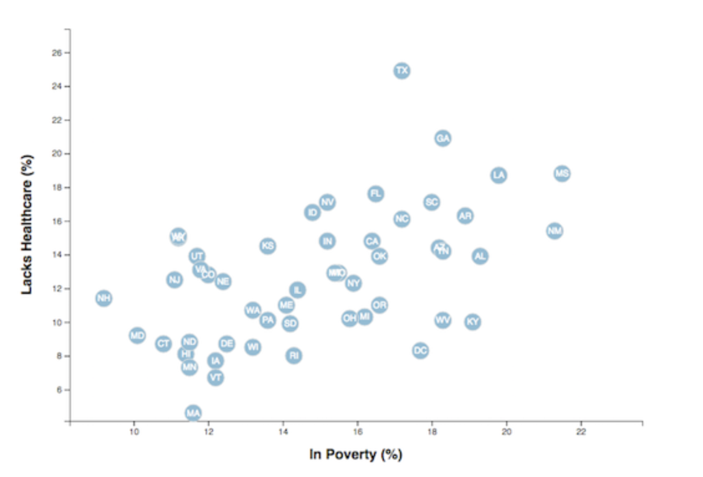

<<<<<<< HEAD
# D3-challenge #
Each point on the plot represents a state

The data set included with the assignment is based on 2014 ACS 1-year estimates: <https://factfinder.census.gov/faces/nav/jsf/pages/searchresults.xhtml>

=======

## D3 Scatter plot comparing healthcare and poverty data in the US ##
* Each point on the plot represents a state
>>>>>>> 49e21eb592ef1c7571c8c1f5d3c61f7ff134116c
